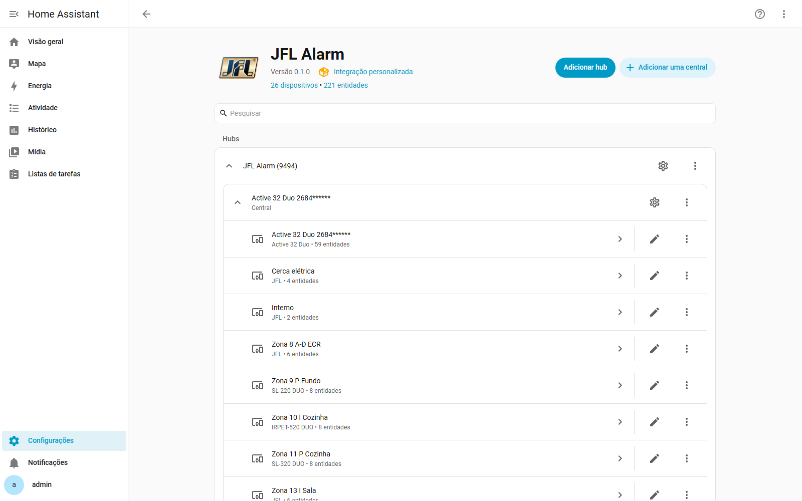
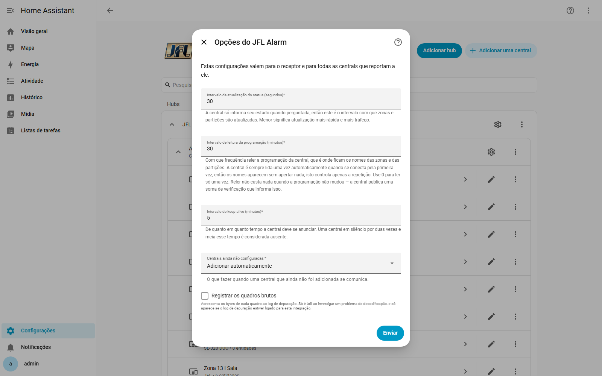
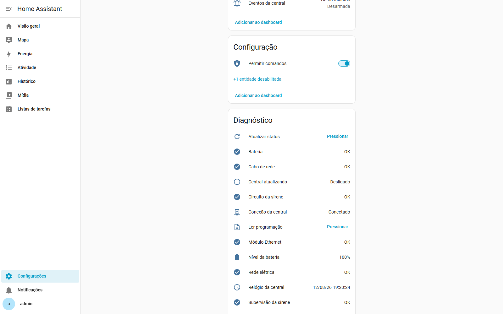
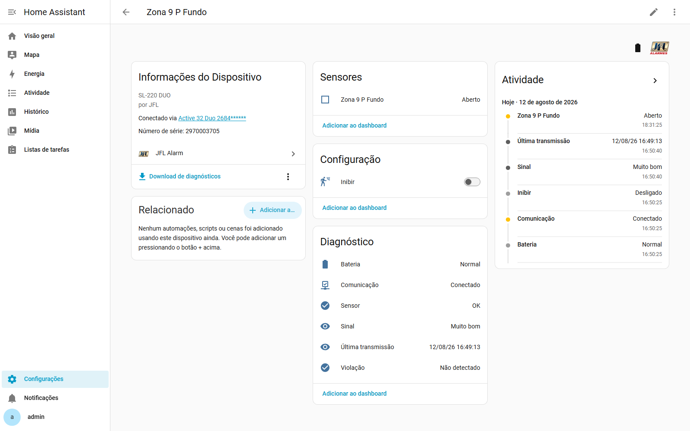
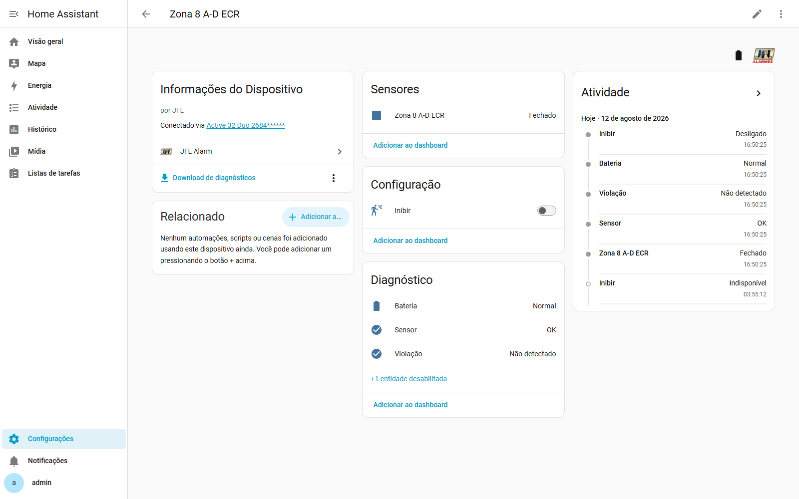

# JFL Alarm — integração para Home Assistant

*[Read in English](README.md)*

Integração do Home Assistant para centrais de alarme **JFL Active**, falando o protocolo TCP da
própria central. Domínio: `jfl_alarm`.

> **Situação: lançada e em uso diário.** Partições, cerca elétrica, saídas PGM e anulação de zonas
> funcionam; a saúde por zona e a camada de ações também. Ler e gravar toda a programação da central
> ainda está por vir. Issues e pull requests são bem-vindos.

## O que ela faz

A central **disca para** o Home Assistant — você programa nela um IP e uma porta de destino, e ela se
conecta e reporta. Quem hospeda o receptor é o Home Assistant. Um único receptor atende **várias
centrais**, cada uma identificada pelo número de série, então centrais de modelos diferentes podem
dividir a mesma instância.

Funcionando hoje:

1. **A cerca elétrica (eletrificador)** — estado e liga/desliga. *Este é o objetivo principal.*
2. **Partições** — armar ausente, armar em casa, desarmar e o estado de disparo.
3. **Saídas PGM** e **anulação de zonas** individuais, com o interruptor de anular no dispositivo da
   própria zona. Cada PGM mostra a função programada nas palavras da JFL; uma saída que a central não
   usa fica na seção de configuração em vez de ficar entre os controles, e a que aciona a cerca
   elétrica não ganha interruptor nenhum — do mesmo jeito que o app da JFL as esconde.
4. **Saúde por zona** — cada zona é um dispositivo próprio, com bateria, supervisão e violação.
5. Problemas da central, tensão da bateria e saúde da conexão.
6. Eventos Contact ID como entidades `event` — inclusive o pânico, que não altera nenhum byte de
   status e por isso é invisível para qualquer coisa que só consulte estado. Cada evento **diz de
   quem ou do que se trata**: um arme aparece como *Bruno*, não *003*, e um disparo nomeia a zona.
7. **A memória de eventos da própria central**, quando você pedir — o `jfl_alarm.read_event_buffer`
   devolve tudo o que ela registrou, inclusive enquanto o Home Assistant esteve desligado.

8. **Leitura da programação da central** — os nomes reais das zonas e das partições, e quais zonas
   são sem fio. Acontece sozinha quando a central se conecta; **Ler programação** e o
   `jfl_alarm.read_programming` forçam.

Ainda por vir: gravar a programação da central pela interface do Home Assistant.

---

## Entidades

Tudo o que está abaixo só aparece **se a central informar que existe**. Uma partição não programada,
uma zona fora de uso e uma central sem cerca elétrica não geram entidade nenhuma — o que é diferente
de uma entidade mostrando "desarmada".

A central vira um dispositivo, com um subdispositivo para cada partição e um para a cerca elétrica.

### A cerca elétrica

| Entidade | Domínio | O que é |
|---|---|---|
| `switch.<cerca>` | `switch` | **Ligado significa armada.** Acioná-lo arma ou desarma o eletrificador |
| `sensor.<cerca>_estado` | `sensor` (enum) | *Desarmada · Armada · Disparada · Não pronta* |
| `binary_sensor.<cerca>_disparo` | `binary_sensor` (safety) | A cerca está em disparo |
| `event.<cerca>_eventos` | `event` | Eventos de arme, desarme e disparo da cerca |

**A cerca deliberadamente não é um `alarm_control_panel`.** Aquele domínio não tem um estado "armado"
puro — os estados armados dele são *ausente*, *em casa*, *noite* e *férias* —
então uma cerca armada aparecia como "Armado ausente", que é algo que um eletrificador não tem como
significar. Um interruptor diz ligado ou desligado, e o sensor de estado diz o resto com as palavras
da própria central. Veja a ADR-0002.

Um fio cortado ou rompido mantém a central em disparo e **nunca se restaura sozinho**, então o sensor
de disparo continua ligado até alguém resolver o problema na central.

### Partições

**Um `alarm_control_panel` por partição programada**, até as quatro que uma Active 32 suporta — cada
uma um alarme independente, que você arma e desarma por conta própria, que é exatamente como uma
central dividida em várias áreas ("casas") deve funcionar. Quantas aparecem é detectado da central:
uma central usando uma única partição, como a do autor, mostra uma; habilite mais na central e mais
aparecem no próximo status, sem reconfigurar nada. A qual partição uma zona pertence fica na
programação da própria central; trazer esse vínculo para o Home Assistant é uma sprint futura, e
precisa de uma captura de uma central com múltiplas partições para decodificar (ainda não suportado).

**Os modos de armar da central ficam nessa mesma entidade.** O mapeamento não é o óbvio, porque
o "AWAY" da JFL não é o "away" do Home Assistant:

| Teclado da central | O que a central faz | Botão no Home Assistant | Comando |
|---|---|---|---|
| **Armar** | Arma tudo. A central **recusa se houver zona aberta** | Armar ausente | `0x4E` |
| **Armar STAY** | Só o perímetro — as zonas com o atributo *stay* ficam inibidas para você poder ficar dentro | Armar em casa | `0x53` |
| **Armar AWAY** | Arma **com** zonas abertas: elas são anuladas automaticamente e voltam ao normal quando fecharem | *não exposto* — veja abaixo | `0x54` |
| **Desarmar** | Desarma | Desarmar | `0x4F` |

**O Home Assistant mostra dois botões de arme, não três.** O arme forçado (*Armar AWAY*) foi
removido em 08/2026 depois de ser testado na central real: a central devolve o mesmo estado do arme
normal, então o terceiro botão fazia, visivelmente, a mesma coisa que o primeiro. Continua sendo um
comando válido da central e pode voltar como serviço se alguém precisar.

Duas consequências que vale conhecer:

- **A central não informa qual dos dois armes totais foi usado.** Ela devolve *Armado ausente* nos
  dois casos, e os dois geram o mesmo evento Contact ID. Só o STAY é distinguível.
- Se "Armar ausente" parecer não fazer nada, **há uma zona aberta** — feche-a, ou anule-a pelo
  interruptor *Inibir* daquela zona, e arme de novo. O atributo `ready` da partição diz isso de
  antemão.

> ⚠️ **Atualizando?** Uma automação que chama `alarm_control_panel.alarm_arm_custom_bypass` numa
> partição JFL vai passar a falhar, em vez de não fazer nada silenciosamente. Troque por
> `alarm_arm_away`.

A entidade da partição também traz o atributo `ready` — o "sem zonas abertas" da própria central, que
diz a uma automação, de antemão, se o arme normal vai ser aceito.

### Saídas PGM

Um `switch` para cada PGM que o modelo da central tem — um portão, uma luz de jardim, uma garagem.
Quem decide quais delas uma conexão remota pode acionar é a central: só as saídas programadas com
**função 12** (com retenção) ou **13** (sem retenção) podem, nos endereços 821–824. As outras
aparecem do mesmo jeito, com o atributo `can_operate` em falso, e acionar uma delas gera um erro
dizendo qual endereço conferir, em vez de simplesmente não fazer nada.

**O que cada saída faz é o que decide qual entidade ela ganha**, e a integração lê isso da própria
central — você não precisa informar nada:

| Função da saída | O que você recebe |
|---|---|
| **18** (ou 25 na Active 20) — ela aciona a cerca elétrica | **nenhuma entidade**: a cerca é operada pelo interruptor dela mesma |
| **0**, *desabilitada* — a central não usa essa saída | um interruptor na central, em *Configuração*, e **desabilitado**: ele existe, mas não há o que acionar |
| qualquer outra | um interruptor na central, em *Controles* |

> **Por que a função 18 não ganha interruptor.** Ela não é a alimentação do eletrificador — é um
> **pulso momentâneo**, ligado no borne *LIGA* e acionado por um ou dois segundos para alternar a
> cerca. Um interruptor para ela nunca poderia ser acionado (o `P-PGM` só libera as funções 12 e 13),
> leria `off` para sempre entre os pulsos, e a única coisa que poderia fazer seria alternar o
> eletrificador por trás da entidade da cerca. A saída continua inteiramente descrita no download de
> diagnósticos, com função e duração.
> ADR-0017.
>
> **Você nunca precisa identificá-la.** A leitura da programação, que acontece sozinha quando a
> central se conecta, detecta a saída do eletrificador — função 18, ou 25 na Active 20. A
> configuração **PGM que aciona a cerca elétrica** é apenas uma *sobreposição*, para quando você
> souber algo que a programação não diz; se os dois divergirem, a sua configuração prevalece e a
> divergência vira um reparo. ADR-0011.
>
> **Por isso os interruptores das PGMs aparecem cerca de meio minuto depois dos demais**, quando essa
> leitura termina. Tudo o que se olha numa emergência — zonas, partições, a cerca — continua
> aparecendo já no primeiro quadro de status, como antes.
>
> Cada interruptor de PGM também traz a `function` decodificada, o tempo de acionamento e o horário
> como atributos, depois que a programação for lida.

### Anulação de zonas

Um `switch` para cada zona que a programação da central permite inibir, em configuração. Ligado
significa zona anulada — fora do alarme.

A central não tem um comando "anular a zona X": ela tem "estas são as zonas inibidas agora". Por
isso, mudar uma zona lê a lista atual de volta da central antes e reenvia com aquela única alteração
— é o que garante que anular a garagem não libere a zona que alguém inibiu no teclado cinco minutos
atrás. ADR-0006.

Repare que uma zona que a central anulou sozinha — porque você armou com ela aberta — aparece aqui
como **não** anulada. Esse é o comportamento da própria central: a anulação automática não entra na
lista manual, e ela se desfaz quando a zona fecha. Acompanhe as entidades de evento pelo código
`1573` se precisar enxergá-la.

### Ações

| Ação | O que faz |
|---|---|
| `jfl_alarm.sync_time` | Acerta o relógio da central pelo Home Assistant. A central carimba todo evento com o relógio dela, então uma central atrasada arquiva o disparo de hoje como se fosse de ontem |
| `jfl_alarm.refresh_status` | Pede um quadro de status à central agora. É leitura, então funciona em modo somente leitura |
| `jfl_alarm.set_bypass_mask` | Substitui toda a lista de anulação em um único comando. Uma lista vazia limpa todas as anulações |
| `jfl_alarm.read_programming` | Lê a programação da central e devolve o conteúdo — os nomes das zonas e das partições acima de tudo. É leitura, funciona em modo somente leitura, e nunca devolve a senha de um usuário |
| `jfl_alarm.read_event_buffer` | Devolve a memória de eventos da própria central — cada arme, desarme, disparo, anulação e problema que ela registrou, inclusive enquanto o Home Assistant esteve desligado, cada um com a descrição e o nome do usuário ou da zona. É leitura, então funciona no modo somente leitura |
| `jfl_alarm.send_raw_command` | Envia um comando arbitrário e devolve o que a central responder. **Só administradores**, e ignora todas as verificações que a integração faz sobre quais comandos são seguros. É uma ferramenta de engenharia reversa |

### Zonas, problemas e o resto

| Entidade | Domínio | Observações |
|---|---|---|
| `binary_sensor.zona_N` | `binary_sensor` (opening) | Aberta, inclusive enquanto dispara. **Cada zona é um dispositivo próprio**, com as quatro abaixo |
| `binary_sensor.zona_N_bateria` | `binary_sensor` (battery) | A bateria de um sensor sem fio está fraca |
| `binary_sensor.zona_N_comunicacao` | `binary_sensor` (connectivity) | Ligado significa que a central continua ouvindo o sensor. Desligada por padrão |
| `binary_sensor.zona_N_violacao` | `binary_sensor` (tamper) | Alguém está mexendo no detector |
| `binary_sensor.zona_N_falha` | `binary_sensor` (problem) | A falha agregada, incluindo curto-circuito |
| `binary_sensor.<central>_problema` | `binary_sensor` (problem) | "Tem algo errado", mais um sensor por bit de problema |
| `binary_sensor.<central>_conexao` | `binary_sensor` (connectivity) | **Continua disponível com a central fora do ar** |
| `binary_sensor.<central>_sirene` | `binary_sensor` (sound) | A sirene está tocando. É só leitura, por isso não é uma entidade `siren` |
| `sensor.<central>_tensao_da_bateria` | `sensor` (voltage) | A tensão real. É a leitura principal da bateria |
| `sensor.<central>_nivel_da_bateria` | `sensor` (battery) | Uma porcentagem *derivada* dela — 10,5 V = 0%, 12,5 V = 100%, com limite nas pontas. É interpretação, não algo que a central disse, então a tensão continua sendo a principal |
| `sensor.<central>_ultima_conexao` · `_ultima_comunicacao` · `_ultimo_evento` | `sensor` (timestamp) | Os dois primeiros continuam legíveis com a central fora do ar — que é justamente quando importam |
| `event.<central>_eventos_da_central` · `event.particao_N_eventos` | `event` | Todos os eventos Contact ID, da central inteira e por partição |
| `button.<central>_atualizar_status` | `button` | Pede um quadro de status à central agora |
| `switch.<central>_permitir_comandos` | `switch` (config) | **A chave geral.** Veja abaixo |
| `switch.<central>_pgm_N` | `switch` | Uma por saída PGM que o modelo tem |
| `switch.zona_N_inibir` | `switch` (config) | Uma por zona que a central permite inibir — **no dispositivo da própria zona** |

São seis entidades por zona, e um dispositivo para cada uma, porque o nibble da zona codifica seis
coisas diferentes; juntar tudo faria "aberta" significar também "a bateria acabou".

**Bateria, violação e comunicação vêm de duas fontes ao mesmo tempo.** O nibble da zona guarda um
valor só, então um sensor com a bateria acabando informa "bateria fraca" enquanto está fechado e
"aberta" no instante em que alguém passa na frente — a bateria continua fraca, a central é que não tem
onde dizer. Os eventos Contact ID `1384`/`3384`, `1383`/`3383` e `1381`/`3381` delimitam cada condição
de forma independente e ficam retidos, então uma bateria fraca sobrevive à porta abrir.
ADR-0008.

### Nomes de verdade, vindos da central

Zonas e partições começam como números, porque o quadro de status não carrega nome nenhum. Aperte
**Ler programação** na página do dispositivo da central — ou chame `jfl_alarm.read_programming` — e
os nomes da própria central aparecem: *Zone 3 Cozinha*, *Interno*, *Externo*. As zonas sem fio também
ganham o número de série impresso no detector.

É um botão, e não algo automático, de propósito: uma leitura completa são trinta e tantas idas e
vindas, e uma central que não responde `0x44` seria consultada trinta vezes a cada reconexão. Fazer
isso na conexão exige antes um *probe* — ADR-0010,
e está planejado.

**Nada aqui grava.** A Sprint 6 lê; o `0x45`, o comando de gravação, não está em nenhum caminho que
uma entidade ou um serviço alcance. E **nenhuma senha de usuário sai do parser** — ele informa se
existe uma, nunca qual é.

Os nomes têm nove caracteres, porque essa é a largura do campo na central.

---

## Segurança e as duas travas

Esta integração controla um alarme de verdade em uma casa habitada, e foi feita para ser difícil de
disparar por acidente.

| Trava | Onde fica | Padrão |
|---|---|---|
| **Modo somente leitura** | Nas configurações da central, dentro da integração | **Ligado** — a integração observa e não envia nada |
| **Permitir comandos** | Um interruptor na página do dispositivo da central | Ligado |

**As duas precisam permitir antes de qualquer envio.** O modo somente leitura é a permissão
deliberada que você desliga uma vez; o interruptor é a chave geral rápida, que dá para acionar de um
painel, de uma automação ou de um script de "modo visita" sem abrir as configurações. Se qualquer uma
das duas recusar, aparece um erro dizendo qual foi — um comando nunca é descartado em silêncio.

Se quem recusar for a própria central (a programação dela não libera aquilo para uma conexão de
monitoramento), o erro diz qual endereço da central conferir, em vez de falhar calado.

### A senha opcional

Você pode definir uma **senha que o Home Assistant pede** antes de desarmar e, se quiser, também
antes de armar. Ela vem vazia e é totalmente opcional — o teclado da central já tem a dele.

- É uma senha **do Home Assistant**. Ela nunca é enviada à central e não tem relação com a senha de
  usuário da central.
- Depois de definida, ela é sempre pedida para desarmar; pedir também na saída é uma opção à parte.
- Ela protege as entidades das partições. **O interruptor da cerca não tem como pedir senha** — o
  domínio `switch` não tem campo de senha — então, se quiser a cerca atrás de uma confirmação, use a
  confirmação do próprio Lovelace no botão, ou uma automação.

### Nenhuma senha chega à central

Todo o conjunto de comandos que esta integração usa (`0x4E`, `0x4F`, `0x53`, `0x54`, `0x4D`) **não
carrega senha**, o que foi confirmado capturando o próprio ActiveNet da JFL operando uma central
real. A família de comandos autenticados foi deixada de fora de propósito: cinco senhas erradas
bloqueiam a operação remota na central até alguém fazer uma operação válida no teclado, e nada aqui
precisa disso. Se alguma central responder "senha incorreta", a integração para na hora e abre um
aviso de reparo.

### Nada é otimista

Nenhuma entidade muda de estado porque um comando foi enviado. Todo comando é seguido de duas
releituras de status, e o que você vê é a resposta da própria central. Isso importa mais do que
parece: na captura de referência, o arme devolveu um quadro de status que ainda mostrava uma zona
aberta, e a central anulou essa zona um segundo depois.

## Centrais suportadas

| Byte do modelo | Central | Partições | Zonas | PGMs | Cerca | Verificada em hardware |
|---|---|---|---|---|---|---|
| `0xA0` | Active 32 Duo | 4 | 32 | 4 | sim | **Sim — firmware 7.60** |
| `0xA1` | Active 20 Ultra / 20 GPRS | 2 | 22 | 4 | sim | Não |
| `0xA2` | Active 8 Ultra | 2 | 12 | 0 | não | Não |
| `0xA3` | Active 20 Ethernet | 2 | 22 | 4 | sim | Não |
| `0xA4` | Active 100 Bus | 16 | 99 | 16 | sim | Não |
| `0xA5` | Active 20 Bus | 2 | 32 | 16 | sim | Não |
| `0xA6` | Active Full 32 | 4 | 32 | 16 | não | Não |
| `0xA7` | Active 20 | 2 | 32 | 4 | sim | Não |
| `0xA8` | Active 8W | 2 | 32 | 4 | sim | Não — e veja a observação abaixo |
| `0x4B` | M-300+ | 0 | 0 | 4 | não | Não |
| `0x5D` | M-300 Flex | 0 | 0 | 2 | não | Não |

**Só a Active 32 Duo foi testada em hardware real.** Todos os outros modelos foram implementados a
partir da especificação da JFL e são exercitados nos testes contra um simulador, o que não é a mesma
coisa. Se você tem uma delas, um relato — funcionando ou não — é bem-vindo.

A Active 8W é duplamente incerta: o próprio ActiveNet da JFL a coloca em uma **geração diferente do
protocolo** (`0x7A`, comprimento de dois bytes), que esta integração não implementa. É provável que
não funcione.

## Instalando

1. Adicione a integração. A única pergunta é a **porta TCP para escutar** — todo o resto é lido da
   central quando ela se conecta.
2. Programe a central para reportar ao endereço desta máquina e a essa porta, em um destino de
   eventos **livre**. Não sobrescreva o destino usado pela sua empresa de monitoramento; ative o
   reporte duplo no endereço 700, TECLA8, para que os dois continuem funcionando.
3. A central aparece sozinha em cerca de um minuto, com as partições, as zonas e a cerca.
4. Para operá-la, abra as configurações da central e desligue o **modo somente leitura**.

Se nada aparecer em quinze minutos, a integração abre um aviso de reparo com essa lista de
verificação — uma integração à qual a central precisa se conectar falha em silêncio por natureza, e
esse aviso é a solução.

Ainda não há release. Quando houver, a instalação será pelo HACS como repositório personalizado.

**A integração também está sendo preparada para o catálogo oficial do Home Assistant**, que é uma
exigência maior que a do HACS: o core obriga que toda a comunicação com o equipamento fique em um
pacote independente publicado no PyPI. Esse pacote é o `pyjfl`, gerado a partir do `protocol/` e do
`server.py` deste repositório — pronto e ainda **não publicado**, porque apontar o manifest para um
pacote inexistente faria o setup falhar em um listener que monitora uma casa de verdade. Veja o
ADR-0019. Para contribuidores, como um
release chega ao HACS, ao PyPI e a uma submissão ao `home-assistant/core`:
docs/development/publishing.md ·
publishing-pyjfl.md — em inglês, como o restante da
documentação técnica.

## Capturas de Tela

*A página da própria integração — dispositivos, entidades e status depois que uma central se conecta.*

*As opções configuráveis: porta de rede, senhas, tempos limite.*

*O dispositivo da central com seus subdispositivos vinculados — zonas, partições e PGMs agrupados sob ele.*

*A página de uma zona sem fio: estado aberto/fechado, intensidade de sinal, bateria e última transmissão.*

*A página de uma zona com fio, com o interruptor de anulação e diagnósticos.*

## Créditos

**Autor:** Jonis Maurin Ceará — jmceara AT gmail.com

**Baseado no** trabalho de **Carlos Jose Fernandes**, <https://github.com/fernac03/JFL_ACTIVE>. Esta
é uma implementação nova, mas apoiada naquela: o original é o registro do que de fato opera uma
central JFL viva, e os offsets de pacote, a tabela de modelos e os quadros de comando dele
orientaram este trabalho. Veja o AUTHORS.md.

O protocolo foi implementado a partir das especificações publicadas pela própria JFL e da observação
do software oficial ActiveNet conversando com uma central.

*Sem qualquer vínculo com a JFL Alarmes, e sem endosso dela.*

### Saúde dos sensores sem fio

Toda zona com detector via rádio ganha, depois que a programação da central é lida:

| Entidade | O que informa |
|---|---|
| **Sinal** | A qualidade do enlace, nos quatro degraus da própria central — *Excelente*, *Muito bom*, *Bom*, … Os atributos trazem o **repetidor** por onde ele chega (`0` = direto), o **firmware** e o **número de série** |
| **Última transmissão** | Quando aquele detector falou pela última vez, como a central registrou |

O **modelo** do detector — *IRD-650 DUO*, *SL-220 DUO* — aparece na página do dispositivo da zona.

Isso vem do inventário sem fio da central, que é um pedido separado da leitura de programação: a
tabela de cadastro diz que a zona *tem* um dispositivo via rádio, o inventário diz em que estado ele
está. Um detector que some do inventário fica *indisponível*, em vez de mostrar um sinal velho.

### Os tempos da central

Oito sensores de diagnóstico, **cada um na sua unidade** — entrada, saída e zona inteligente em
segundos; porta aberta, falta de AC e falta de linha em minutos. Um tempo que o instalador desligou
aparece como *desconhecido*, não como `0`.

## Instalação

Instale pelo [HACS](https://hacs.xyz) como repositório personalizado:

1. HACS → ⋮ → **Repositórios personalizados**
2. Repositório: `https://github.com/jmceara/jfl_alarm` — categoria: **Integration**
3. Instale **JFL Alarm**, reinicie o Home Assistant e adicione em
   **Configurações → Dispositivos e Serviços → Adicionar Integração**.

A central **disca para fora**, então nada precisa ser acessível pela internet: programe o destino
de eventos da central com o endereço LAN desta máquina e a porta escolhida (9494 por padrão).

Todo o tratamento de frames vive em [`pyjfl`](https://pypi.org/project/pyjfl/), um pacote
independente que o Home Assistant instala sozinho.
